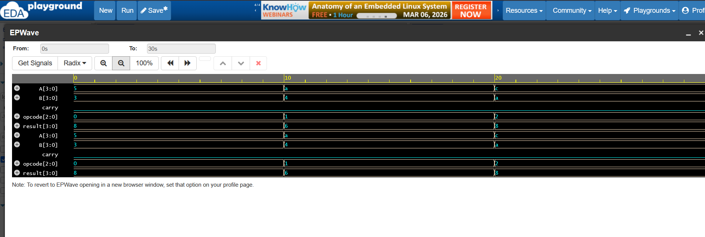

# 4-Bit Arithmetic Logic Unit (ALU) Design

## Project Overview
This project involves the design and functional verification of a **4-bit Arithmetic Logic Unit (ALU)** using Verilog HDL. This task was completed as part of my VLSI Design Internship at **CODTECH IT Solutions**. The ALU is a fundamental building block of a digital system, capable of performing various arithmetic and logical operations based on a selection opcode.

## Features & Functionality
The ALU supports the following 5 operations controlled by a 3-bit `opcode`:

| Opcode | Operation | Description |
| :--- | :--- | :--- |
| `000` | **ADD** | Arithmetic Addition of A and B |
| `001` | **SUB** | Arithmetic Subtraction of B from A |
| `010` | **AND** | Bitwise Logical AND |
| `011` | **OR** | Bitwise Logical OR |
| `100` | **NOT** | Bitwise Logical NOT (Inverse of A) |

## Tools Used
* [cite_start]**Language:** Verilog HDL [cite: 24]
* [cite_start]**Simulator:** Icarus Verilog [cite: 83]
* [cite_start]**Platform:** EDA Playground [cite: 83]
* [cite_start]**Waveform Viewer:** EPWave / GTKWave [cite: 25]

## Simulation Results
The design was verified using a testbench that applies multiple test cases. The output waveforms confirm that the `result` and `carry` flags update correctly according to the `opcode`.

### Waveform Analysis

* **Case 1 (Addition):** Inputs A=5, B=3, Opcode=000 → Result=8.
* **Case 2 (Subtraction):** Inputs A=10, B=4, Opcode=001 → Result=6.
* **Case 3 (Bitwise AND):** Inputs A=1100, B=1010, Opcode=010 → Result=1000.

## Repository Structure
* `design.sv`: Contains the RTL implementation of the ALU.
* `testbench.sv`: Comprehensive testbench for functional verification.
* `alu_waves.vcd`: Simulation dump file for waveform analysis.
* `waves.png`: Screenshot of the simulation results.

## Conclusion
The 4-bit ALU design successfully meets all functional requirements and passes all test cases in the simulation environment.
